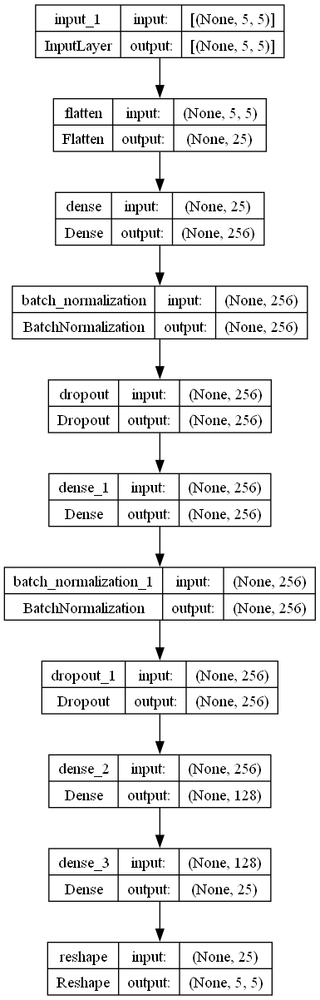
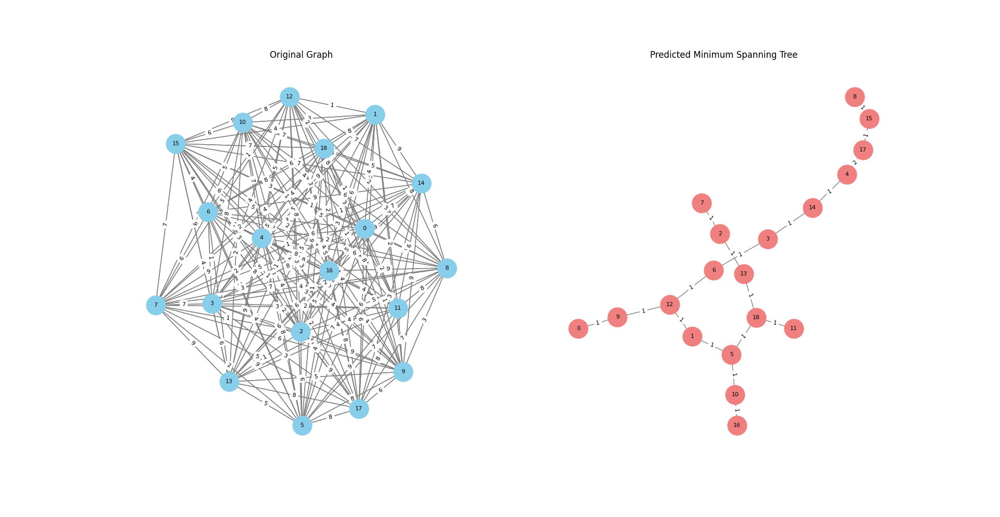

# GraphSpanner Neural Network Project 🌳

## Overview
The GraphSpanner Neural Network Project is dedicated to creating a machine learning model that generates minimal spanning trees for graphs with up to 20 nodes. Leveraging the synergy of graph theory and neural networks, this project offers a versatile solution for small-scale spanning tree generation.

## Project Structure
### Files

- **`Create_MST_Training_Data.py`**: Script to create training data to train the model.
- **`Train_MST_Model.py`**: Script for training the neural network model.
- **`Run.py`**: Script for run the created model.

### Dependencies

These libraries are fundamental to the functionality and development of the GraphSpanner Neural Network Project:

- **Python 3.x:** The programming language used for development.
- **NetworkX:** A Python library for creating, analyzing, and visualizing complex networks.
- **NumPy:** A powerful library for numerical operations, essential for data manipulation.
- **Matplotlib:** A plotting library for creating visualizations, including graph visualizations.
- **Joblib:** Used for efficient parallel computing and data caching, contributing to improved performance.
- **Scikit-learn:** Provides tools for machine learning, including model selection and data preprocessing.
- **TensorFlow:** An open-source machine learning framework used for building and training neural network models.
- **SciPy:** Used for scientific and technical computing, particularly for the minimum spanning tree calculation.


## Pre-trained Model
A pre-trained H5 model named `mst_prediction_model.h5` is available for use.

## Model Visualization



## Example Output



## To demonstrate the functionality of the GraphSpanner Neural Network, follow these steps:

1. **Clone the Repository:**
   ```bash
   git clone https://github.com/madfox99/GraphSpanner.git
   ```
2. **Install Dependencies:**
   ```python
   pip install -r requirements.txt
   ```
4. **Run the Example Script:**
   ```python
   python Run.py
   ```
6. **Enter Graph Input: (Example)**
   ```bash
   1-2=>3, 1-3=>1, 1-4=>2, 1-5=>4,2-3=>5, 2-4=>6, 2-5=>7,3-4=>8, 3-5=>9,4-5=>10
   ```
8. **View Results:**
   The script will visualize the original graph and the predicted minimum spanning tree.
